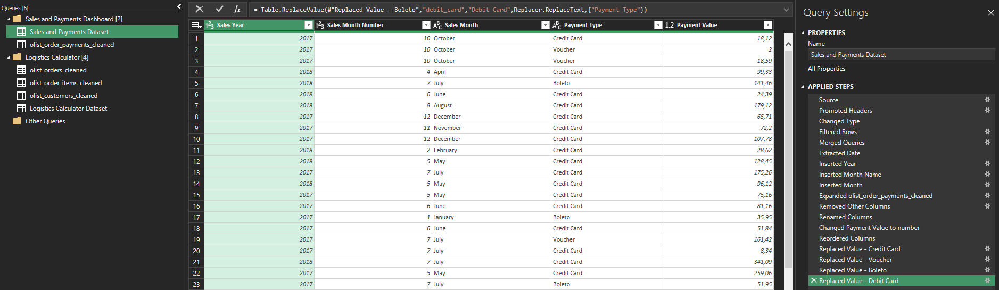
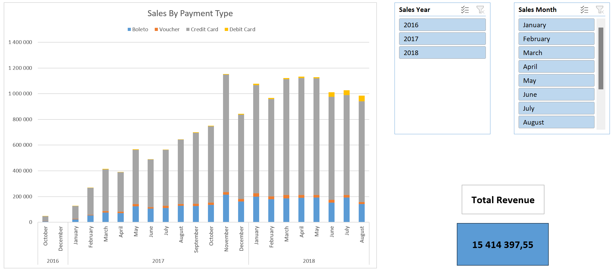

# 📊 Brazilian E-commerce Analysis (Olist Dataset)

### **Project Overview**
This project focuses on extracting actionable business insights from a large-scale e-commerce dataset containing over 100,000 orders. To tackle complex business problems — such as sales growth, logistics bottlenecks, brand profitability, and customer retention — I implemented a two-step workflow:

1. **Data Extraction (SQL):** Writing queries to aggregate, clean, and segment raw data directly from the relational database.
2. **Advanced Analysis (Python):** Utilizing libraries like Pandas, Seaborn, and SciPy to test statistical hypotheses, uncover correlations, and create impactful data visualizations.

This project was developed as a practical exercise to master end-to-end business data analysis, where I utilized AI assistance to refine complex logic and optimize the workflow. The ultimate goal was to bridge the gap between raw database metrics and strategic, real-world business recommendations.

---

### 📂 Project Files
* 💾 **SQL Queries:** [analysis_queries.sql](scripts/analysis_queries.sql)
* 🐍 **Python Script:** [python_code.py](scripts/python_code.py)

---

## 🧹 Task 0: Data Cleaning & Data Validation
#### **Objective:**
To ensure data integrity before performing advanced analysis or statistical modeling – specifically by identifying missing values, duplicates and resolving data anomalies.

#### **Python Query:**
```python
# 1. Dropping delivered orders with missing critical timestamps
indexes_to_drop = orders[(orders['order_status'] == 'delivered') & (orders.isna().any(axis=1))].index
orders = orders.drop(indexes_to_drop)

# 2. Removing data anomalies
invalid_dates_index = orders[orders['order_delivered_carrier_date'] > orders['order_delivered_customer_date']].index
orders = orders.drop(invalid_dates_index)

# 3. Filling missing product categories
products['product_category_name'] = products['product_category_name'].fillna('Unknown')

# 4. Filling missing physical dimensions
dimensions = ['product_weight_g', 'product_length_cm', 'product_height_cm', 'product_width_cm']

for col in dimensions:
    products[col] = products[col].fillna(
        products.groupby('product_category_name')[col].transform('median')
    )
    
    global_median = products[col].median()
    products[col] = products[col].fillna(global_median)

# 5. Dropping duplicates
geolocation = geolocation.drop_duplicates()
```

#### **Analysis & Results:**
The Python script cleans the raw dataset to fix missing values, logical errors and duplicates. Key steps include filling missing product dimensions using category medians, labeling empty product categories as "Unknown", and removing impossible records (like orders delivered before they were even shipped). Minor missing details were left alone to preserve data volume. Additionally, duplicate rows were removed. Finally, the clean dataset was exported to an SQL database for further analysis. Full code showing the process of finding missing values, duplicates and checking datasets for anomalies can be found in the Python code file.

#### **Business Insights:**
Good business decisions require clean data. By fixing broken delivery dates etc., we make sure our calculations for profitability and logistics are accurate. This step guarantees that all the final recommendations in this project are built on solid, trustworthy numbers.

---

# 📈 Task 1: Revenue & Sales Trend

## Step A: Monthly Revenue (SQL)
#### **Objective:**
To track the platform's financial health by identifying monthly revenue growth and order volume patterns.

#### **SQL Query:**
```sql
SELECT 
strftime('%Y-%m', order_purchase_timestamp) AS time, ROUND(SUM(items.price + items.freight_value), 2) AS total_revenue, 
COUNT(DISTINCT orders.order_id) AS number_of_orders 
FROM olist_orders_dataset AS orders
INNER JOIN olist_order_items_dataset AS items
ON orders.order_id = items.order_id
WHERE orders.order_status = 'delivered'
GROUP BY time 
ORDER BY time ASC;
```

#### **Analysis & Results:**
The query examines every delivered order and groups them into monthly intervals, showing both total revenue and the number of orders for each month.

#### **Visual Result:**


#### **Business Insights:**
The data shows a consistent upward trend in both revenue and the number of orders, with a significant peak in **November 2017** (probably due to Black Friday). Understanding these peaks helps the business plan inventory and server capacity for future high-traffic seasons.

---

## Step B: Smoothed Sales Trend (Python)
#### **Objective:**
To smooth out daily sales volatility (e.g., weekend drops) and visualize the true underlying macroeconomic trend of the platform using a Rolling Average.

#### **PYTHON Query:**
```python
dataframe_merged = pd.merge(orders, order_items, how='left', on='order_id')

dataframe_merged['daily_sale'] = dataframe_merged['price'] + dataframe_merged['freight_value']
dataframe_merged['order_purchase_timestamp'] = pd.to_datetime(dataframe_merged['order_purchase_timestamp'])
dataframe_merged['order_date'] = dataframe_merged['order_purchase_timestamp'].dt.date

dataframe_merged_grouped = (dataframe_merged.groupby('order_date').agg({'daily_sale': 'sum'}) .sort_values(by=['order_date'], ascending=[True]))
dataframe_merged_grouped['rolling_mean_7d'] = dataframe_merged_grouped['daily_sale'].rolling(window=7).mean()

p6 = sns.relplot(
    data=dataframe_merged_grouped,
    x='order_date',
    y='rolling_mean_7d',
    kind='line',       
)

p6.fig.suptitle('Store Sales Trend (7-Day Rolling Average)', y=0.99)
p6.set_axis_labels('Order Date', 'Sale')
plt.xticks(rotation=45)
plt.show()
```

#### **Analysis & Results:**
The script merges order data with items, converts purchase timestamps to date objects, and calculatess total daily sales. A 7-day rolling mean is then applied to the daily revenue to smooth out short-term fluctuations. The smoothed time series is visualized to reveal the overarching trend.

#### **Visual Result:**


#### **Business Insights:**
Applying a 7-day rolling window effectively eliminates the daily noise caused by standard weekly shopping habits (e.g., weekend transaction dips). This exposes the true, smoothed growth trajectory of the platform, providing a much more reliable foundation for forecasting warehouse staffing and inventory levels ahead of major shopping events.

---

# 📦 Task 2: Product portfolio & Profitability
## Step A: Top Product Categories (SQL)
#### **Objective:**
To identify which product category provides the most revenue and determine if they rely on high sales volume or premium pricing.

#### **SQL Query:**
```sql
SELECT 
COALESCE(trans.product_category_name_english, products.product_category_name) AS category, 
ROUND(SUM(items.price + items.freight_value),2) AS sale,
COUNT (items.product_id) AS number_of_items_sold, 
ROUND(AVG(items.price), 2) AS avg_price
FROM olist_orders_dataset AS orders
INNER JOIN olist_order_items_dataset AS items ON orders.order_id = items.order_id 
INNER JOIN olist_products_dataset AS products ON items.product_id = products.product_id
LEFT JOIN product_category_name_translation AS trans ON products.product_category_name = trans.product_category_name 
WHERE orders.order_status = 'delivered'
GROUP BY category
ORDER BY sale DESC 
LIMIT 10;
```

#### **Analysis & Results:**
The query links sold items to their specific categories and translates them into English using a translation table. It calculates total gross sales, the total volume of items sold, and the average price per item to provide a comprehensive view of category performance.

#### **Visual Result:**


#### **Business Insights:**
Health & Beauty and Watches are the primary revenue drivers for the platform. The analysis shows that different categories have different profit models: some (like Bed Bath Table) rely on high sales volume, while others (like Watches) generate high revenue through premium pricing. These insights allow the business to tailor marketing strategies and optimize stock levels based on category-specific performance.

---

## Step B: Margin killers (PYTHON)
#### **Objective:**
To cross-reference the top revenue-generating product categories with their average customer review scores, identifying "margin killers" - categories that drive high gross sales but suffer from poor customer satisfaction.

#### **PYTHON Query:**
```python
merged_df = pd.merge(orders, order_reviews, how='left', on='order_id')
merged_df = pd.merge(merged_df, order_items, how='left', on='order_id')
merged_df = pd.merge(merged_df, products, how='left', on='product_id')
merged_df = pd.merge(merged_df, category_translation, how='left', on='product_category_name')

merged_df['revenue'] = merged_df['price'] + merged_df['freight_value']
merged_df_grouped = (merged_df.groupby('product_category_name_english').agg({'revenue':'sum','review_score':'mean'})                )
top_20_revenue = merged_df_grouped.nlargest(20, 'revenue')
merged_df_grouped_top10 = top_20_revenue.nsmallest(10, 'review_score')
print(merged_df_grouped_top10)

p5 = sns.catplot(
    x='product_category_name_english', 
    y='revenue', 
    data=merged_df_grouped_top10, 
    kind='bar', 
    hue='review_score',
)

p5.fig.suptitle('Product categories with the highest revenue and worst reviews', y=0.99)
p5.set_axis_labels('Product category', 'Revenue per product category [mln]')
plt.xticks(rotation=45, ha='right')
plt.show()
```

#### **Analysis & Results:**
The script groups the merged dataset by product category to calculate both total gross revenue and the average review score. It first filters for the top 20 categories by revenue, and then isolates the 10 with the lowest average ratings. The disparity between high sales volume and low customer satisfaction is visualized using a bar chart.

#### **Visual Result:**


#### **Business Insights:**
High gross revenue can be a dangerous metric when viewed in isolation. The categories highlighted in this analysis generate significant cash flow but are actively damaging the platform's reputation. The true profit margin on these specific items is likely severely diminished by the hidden operational costs of products' returns.

---

# 🚚 Task 3: Logistics & Delivery Performance
## Step A: Regional Delivery Delays (SQL)
#### **Objective:**
To pinpoint specific geographical regions experiencing critical shipping delays to optimize the logistics network.

#### **SQL Query:**
```sql
WITH delivery_performance AS (
SELECT customers.customer_state, orders.order_id,
CASE 
WHEN (julianday(orders.order_delivered_customer_date) - julianday(orders.order_estimated_delivery_date)) > 3 THEN 'Very Late'
WHEN (julianday(orders.order_delivered_customer_date) - julianday(orders.order_estimated_delivery_date)) > 0 THEN 'Slightly Late'
ELSE 'On-time or Early'
END AS delivery_status
FROM olist_orders_dataset AS orders
JOIN olist_customers_dataset AS customers ON orders.customer_id = customers.customer_id
WHERE orders.order_status = 'delivered'
)
SELECT customer_state,
COUNT(*) AS total_orders,
SUM(CASE WHEN delivery_status = 'Very Late' THEN 1 ELSE 0 END) AS very_late_count,
ROUND((SUM(CASE WHEN delivery_status = 'Very Late' THEN 1 ELSE 0 END) * 100.0) / COUNT(*), 2) AS percentage_very_late
FROM delivery_performance
GROUP BY customer_state
ORDER BY percentage_very_late DESC
LIMIT 5;
```
#### **Analysis & Results:**
The query compares the actual delivery date with estimated delivery date promised to the customer. Based on the ddifference between these days, delivered orders were categorized as On-time or Early, Slightly Late and Very Late (more than 3 days of delivery delay). This allowed for calculating the percentage of critical delays (marked as Very Late) of all orders per state, identifying regional logistical bottlenecks.

#### **Visual Result:**


#### **Business Insights:**
The analysis identifies specific states (primarily in the North-East region) that suffer from significantly higher critical delay rates compared to the rest of the country. The company should evaluate its carrier partnerships to  provide better delivery performance in these high-delay states.

---

## Step B: The Cost Of Delays (SQL)
#### **Objective:**
To prove the direct correlation between shipping speed and customer ratings (Review Scores).

#### **SQL Query:**
```sql
WITH delivery_and_reviews AS (
SELECT orders.order_id, reviews.review_score,
CASE 
WHEN (julianday(orders.order_delivered_customer_date) - julianday(orders.order_estimated_delivery_date)) > 3 THEN 'Very Late'
WHEN (julianday(orders.order_delivered_customer_date) - julianday(orders.order_estimated_delivery_date)) > 0 THEN 'Slightly Late'
ELSE 'On-time or Early'
END AS delivery_status
FROM olist_orders_dataset AS orders
JOIN olist_order_reviews_dataset AS reviews ON orders.order_id = reviews.order_id
WHERE orders.order_status = 'delivered'
)
SELECT 
delivery_status,
COUNT(*) AS number_of_reviews,
ROUND(AVG(review_score), 2) AS average_review_score
FROM delivery_and_reviews
GROUP BY delivery_status
ORDER BY average_review_score DESC;
```
#### **Analysis & Results:**
This analysis connects logistics data with customer sentiment. By calculating the difference between actual and estimated delivery dates, orders were categorized into three delivery delay segments (same as Task3). Then the average review score (1-5) was calculated for each segment. This reveals exactly how much delivery performance impacts customer satisfaction.

#### **Visual Result:**


#### **Business Insights:**
The data clearly shows a sharp decline in average ratings for "Very Late" deliveries compared to those that arrive on time. Logistics is a critical driver of brand reputation. Improving shipping reliability is the most direct way to increase the overall satisfaction score of the platform. This correlation helps the business justify higher investments in logistics optimization by showing its direct impact on customer feedback.

---

## Step C: Delivery Bottlenecks (PYTHON)
#### **Objective:**
To investigate root causes of the critical delivery delays identified in Step A by analyzing the impact of shipping costs (freight value) and logistics complexity (local vs. interstate transit).

#### **PYTHON Query:**
```python
# 1. Calculate delivery time in days
df_merged = pd.merge(orders, customers, how='inner', on='customer_id')
df_merged['order_delivered_customer_date'] = pd.to_datetime(df_merged['order_delivered_customer_date'])
df_merged['order_delivered_carrier_date'] = pd.to_datetime(df_merged['order_delivered_carrier_date'])
df_merged['delivery_time_days'] = (df_merged['order_delivered_customer_date'] - df_merged['order_delivered_carrier_date']).dt.days

# 2. Merge freight value data
df_merged = pd.merge(df_merged, order_items[['order_id', 'freight_value']], on='order_id', how='left')

# 3. Statistical Testing: Pearson Correlation
df_clean = df_merged.dropna(subset=['freight_value', 'delivery_time_days'])
correlation, p_value = pearsonr(df_clean['freight_value'], df_clean['delivery_time_days'])
print(f"Correlation coefficient: {round(correlation, 3)} | P-value: {round(p_value, 5)}")

# 4. Visualization: Scatterplot
p2 = sns.relplot(
    data=df_clean, 
    x='freight_value', 
    y='delivery_time_days',
    kind='scatter'
)
p2.fig.suptitle('Correlation between freight value and delivery time', y=0.99)
p2.set_axis_labels('Freight value', 'Delivery time (days)')
plt.show()
```
#### **Analysis & Results:**
The script calculates the actual delivery time in days and visualizes its distribution across the five worst-performing states. To objectively identify the bottleneck, a Pearson correlation coefficient was calculated, testing the relationship between shipping costs and transit times, which was also shown on the scatterplot. Finally, a comparative boxplot was generated to segment deliveries into local (intra-state) and interstate shipments and compare delivery times between these two groups. The rest of the code showing the process of creating two bar plots can be found in the python code file.

#### **Visual Result:**


#### **Business Insights:**
The state-level distribution reveals a systemic issue: in the worst-performing regions, a standard delivery regularly takes over 20 days, with extreme outliers waiting nearly 200 days. The statistical test (r = 0.197) proves that shipping costs are only very weakly correlated with these delays, meaning distance and package weight are not the main issues. Instead, the comparative boxplots clearly demonstrate that crossing state borders is the primary driver of extended transit times. To optimize logistics, the company should encourage sellers to utilize regional fulfillment centers, shifting the focus from interstate shipping to localized delivery networks.

---

# 👥 Task 4: Customer Retention & Lifecycle
## Step A: One-Time vs. Returning Customers (SQL)
#### **Objective:**
To measure customer "stickiness" by identifying returning users and evaluating their spending habits compared to one-time buyers.

#### **SQL Query:**
```sql
WITH customer_order_counts AS (
SELECT customers.customer_unique_id,
COUNT(orders.order_id) AS order_count,
SUM(payments.payment_value) AS total_spent
FROM olist_orders_dataset AS orders
INNER JOIN olist_customers_dataset AS customers ON orders.customer_id = customers.customer_id
INNER JOIN olist_order_payments_dataset AS payments ON orders.order_id = payments.order_id
WHERE orders.order_status = 'delivered'
GROUP BY customers.customer_unique_id
),
customer_segmentation AS (
SELECT customer_unique_id, order_count, total_spent,
CASE 
WHEN order_count > 1 THEN 'Returning Customer'
ELSE 'One-time Customer'
END AS loyalty_segment
FROM customer_order_counts
)
SELECT 
loyalty_segment,
COUNT(customer_unique_id) AS number_of_customers,
ROUND(AVG(total_spent / order_count), 2) AS avg_order_value,
ROUND(COUNT(customer_unique_id) * 100.0 / (SELECT COUNT(*) FROM customer_segmentation), 2) AS percentage_share
FROM customer_segmentation
GROUP BY loyalty_segment;
```
#### **Analysis & Results:**
The query tracks unique individual customers throughout the platform's history and segments them into "Returning" and "One-time" categories, so it is able to compare the size of each group, their percentage share and their average transaction value.

#### **Visual Result:**


#### **Business Insights:**
The vast majority of the database consists of one-time buyers, which highlights a massive opportunity for growth through retention-focused marketing and loyalty programs. Understanding the spending patterns of returning customers allows the business to calculate a more accurate Customer Lifetime Value (LTV), which is crucial for determining how much can be spent on acquiring new users.

---

## Step B: Customer Retention Window (PYTHON)
#### **Objective:**
To analyze the purchasing rhythm of the returning customers by calculating the exact time elapsed between their first and second order, defining the optimal retargeting window.

#### **PYTHON Query:**
```python
df_retention = pd.merge(orders, customers, how='inner', on='customer_id')

returning_customers = df_retention[df_retention.groupby('customer_unique_id')['customer_id'].transform('count') >= 2]
returning_customers['order_purchase_timestamp'] = pd.to_datetime(returning_customers['order_purchase_timestamp'])

returning = returning_customers.sort_values(by='order_purchase_timestamp')
returning = returning.set_index('customer_unique_id')

date_of_first_purchase = returning.groupby('customer_unique_id')['order_purchase_timestamp'].nth(0)
date_of_second_purchase = returning.groupby('customer_unique_id')['order_purchase_timestamp'].nth(1)

customer_retention_window = (date_of_second_purchase - date_of_first_purchase).dt.days

customer_retention_window_days = customer_retention_window.reset_index(name='days till second purchase')
customer_retention_window_days = customer_retention_window_days[customer_retention_window_days['days till second purchase'] > 0]

most_common_customer_retention_window = customer_retention_window_days['days till second purchase'].value_counts().head(5)

print("Top 5 most common customer retention windows (days):")
print(most_common_customer_retention_window)

p4 = sns.histplot(
    data=customer_retention_window_days, 
    x='days till second purchase', 
    binwidth=7,            
    binrange=(1, 365),     
    kde=True               
)

plt.title('Time between first and second purchase of a customer', y = 0.99)
plt.xlabel('Time till second purchase (days)')
plt.ylabel('Number of clients')
plt.xlim(1, 365) 
plt.show()
```
#### **Analysis & Results:**
The script filters the dataset to isolate users with multiple orders and extracts the exact timestamps of their first and second purchases. By calculating the difference in days, it generates a distribution histogram filtered to a standard one-year (365 days) timeframe, grouped into weekly (7-day) bins.

#### **Visual Result:**


#### **Business Insights:**
The data shows that when customers return, they do it quickly—most often within the first week (1 to 7 days) after their first purchase. This means immediate engagement is key. To turn more one-time buyers into repeat customers, the marketing team should send automated "forgot something?" emails or quick discounts right after the first order. Focusing on this crucial first week is the best way to drive retention.

---

# 👥 Task 5: Sales & Payment Dashboard
## Excel and Excel Power Query
#### **Objective:**
To provide the sales team with an interactive dashboard to monitor revenue by payment method and month.

#### **Analysis & Results:**
The data was processed in the background using Power Query to merge datasets, filter for 'delivered' orders, extract date components and standardize payment methods. This clean data model powers a dynamic Excel dashboard featuring a stacked Pivot Chart, interactive Slicers for time filtering (Year, Month), and a Total Revenue KPI card.

#### **Visual Result:**



#### **Business Insights:**
Credit Card is the dominant payment method across all months. The data shows a massive revenue spike in November 2017 (likely Black Friday), which helped establish a higher, stable baseline for sales in the first half of 2018.

---

# 👥 Task 6: Dynamic Shipping Cost Simulator
## Excel and Excel Power Query
#### **Objective:**
To build a dynamic Excel calculator for the logistics team to check historical shipping costs by region and simulate the financial impact of offering shipping discounts to customers.

#### **Analysis & Results:**
The backend was prepared using Power Query to merge datasets and remove unnecessary columns, creating a clean, two-column database. For the frontend dashboard, a custom calculator was built using a dropdown list and the `SUMIFS` function to dynamically sum costs for the selected state. Finally, a What-If Analysis Data Table with Conditional Formatting was integrated to visualize multiple customer discount scenarios.

#### **Visual Result:**


#### **Business Insights:**
The simulation matrix clearly shows that offering shipping discounts to customers above the 15% threshold (marked in red) risks severe margin loss. For states with high shipping volumes like Rio de Janeiro (RJ), uncontrolled shipping promotions can lead to massive capital drain.

---

## 🎯 Final Business Conclusion

Based on the hybrid SQL and Python analysis of the Olist dataset, the company’s current condition and strategic imperatives can be summarized as follows:

*   **Growth Potential & Trends:** The business is in a strong expansion phase. Consistent monthly revenue growth and massive scalability during peak seasons (like Black Friday) indicate a healthy, growing market presence.
*   **Logistics as a Reputation Threat:** Delivery performance is the biggest bottleneck and directly correlates with poor customer ratings. While SQL identified critical delays in specific regions, the Python analysis proved that the root cause is **interstate shipping borders**, not freight costs. To protect its reputation, Olist must incentivize sellers to utilize regional fulfillment centers to keep deliveries localized.
*   **The Customer Loyalty Gap:** The platform is dangerously reliant on new customer acquisition, with over 94% of the user base being one-time buyers. However, Python analysis uncovered a critical **1 to 7-day retention window**. The company must shift its marketing budget toward immediate, automated post-purchase re-engagement to convert these buyers before they go cold.
*   **Product Strategy & "Margin Killers":** The platform's revenue relies on a split model of high-volume budget items and lower-volume premium goods. However, the Python analysis uncovered a hidden threat: certain high-revenue categories act as "margin killers" due to consistently poor customer reviews. To maximize true profitability and protect brand trust, the company must audit the quality of these high-selling but low-rated products. Moving forward, Olist must decide whether to enforce stricter quality controls on budget items or shift its focus toward higher-rated premium goods.
